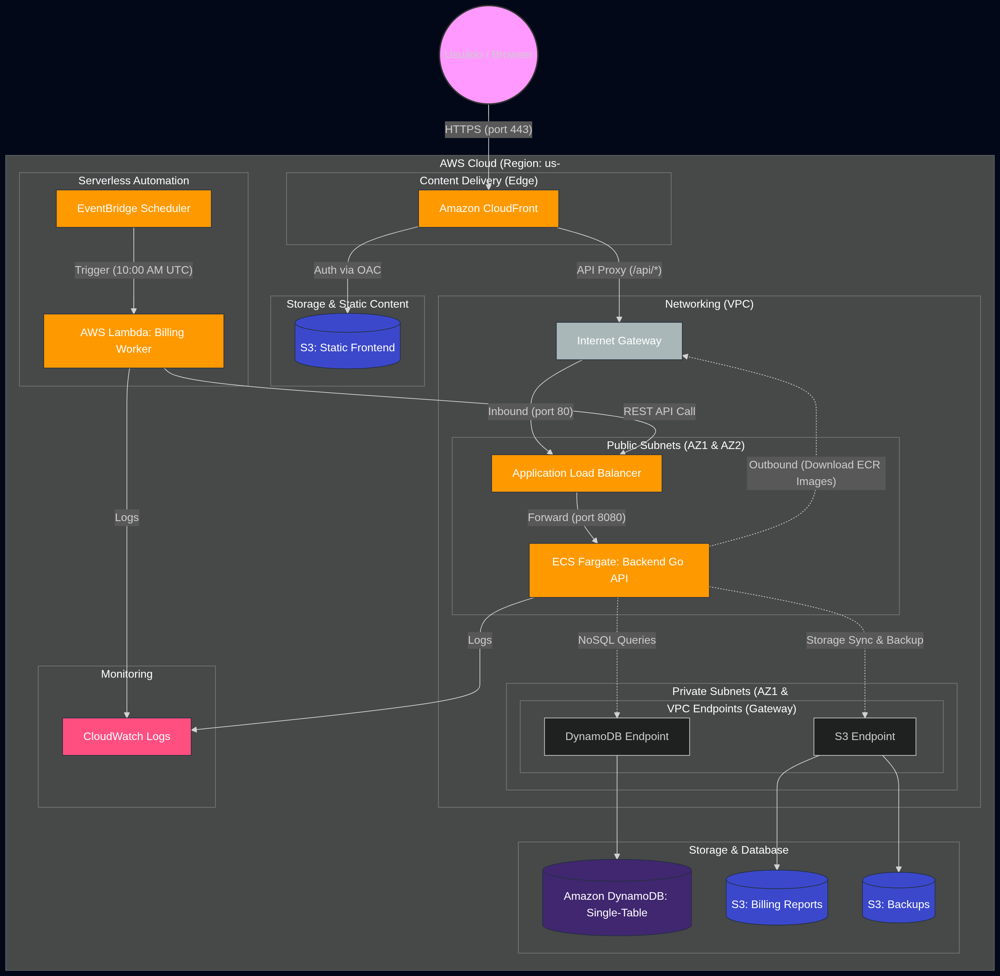

# Guia Técnico e Arquitetura Detalhada

O projeto é uma aplicação moderna baseada em micro-serviços serverless na AWS, projetada para escalabilidade, baixo custo e facilidade de manutenção.

## Visão Geral da Arquitetura

Aqui está o diagrama da arquitetura completa na AWS, otimizada para **FinOps** (baixo custo) e **Segurança**:



### Fluxo de Dados Real

1.  **Entrada Única**: Todo o tráfego externo passa pelo **CloudFront** via HTTPS.
2.  **Roteamento Intra-CloudFront**: 
    *   Chamadas para `/api/*` são encaminhadas para o **ALB**.
    *   O restante é servido via **S3 (Static Hosting)** protegido por OAC.
3.  **Backend (ECS Fargate)**: As tarefas rodam em **Sub-redes Públicas** com IPs públicos para evitar o custo de um NAT Gateway. A segurança é garantida via Security Groups que aceitam apenas tráfego vindo do ALB.
4.  **VPC Endpoints (Gateway)**: A comunicação com o S3 e DynamoDB é feita via endpoints do tipo Gateway, que são gratuitos e mantêm o tráfego dentro da rede da AWS, reduzindo custos de transferência de dados e aumentando a segurança.
5.  **Otimização de Armazenamento**: Os buckets de Billing e Backup possuem políticas de **Lifecycle** que movem dados para o **Glacier Instant Retrieval** após 30 dias, reduzindo custos de retenção a longo prazo.
6.  **Single-Table Design**: O DynamoDB utiliza uma única tabela para todas as entidades, otimizando custos de provisionamento e latência.

## Componentes

### 1. Frontend (Next.js)
- **Tecnologia:** Next.js (Static Export).
- **Hospedagem:** Amazon S3 (Bucket Privado).
- **Distribuição:** Amazon CloudFront com **Origin Access Control (OAC)** para HTTPS e cache global.
- **Vantagem:** Custo zero em repouso e alta performance via Edge Locations.

### 2. Backend (Go API)
- **Tecnologia:** Go (Golang) com Clean Architecture.
- **Hospedagem:** AWS ECS Fargate (Serverless Containers).
- **Rede:** Implantado em sub-redes públicas (FinOps optimization) para eliminar custos de NAT Gateway.
- **Orquestração:** Load Balancer (ALB) atuando como ponte entre o CloudFront e as tarefas Fargate.

### 3. Banco de Dados (DynamoDB)
- **Modelo:** NoSQL Single-Table Design.
- **Acesso:** Via VPC Endpoint para evitar cobranças de tráfego de saída (Data Transfer Out).

### 4. Background Worker (Lambda)
- **Tecnologia:** Go Lambda.
- **Gatilho:** Amazon EventBridge (Cron mensal/diário).
- **Integração:** Chama a API diretamente através do DNS do **ALB**, evitando custos de transferência de dados e latência do CloudFront.

### 5. Storage (S3)
- **Uso:** Armazenamento de relatórios CSV e backups JSON, acessados via VPC Endpoint.
- **Diferencial:** Possui política de **Lifecycle** que move arquivos para **Glacier Instant Retrieval (GLACIER_IR)** após 30 dias para otimização extrema de custo.

---

## Estrutura do Projeto

```text
├── .github/workflows/          # CI/CD (terraform lint, docker build, lambda build)
├── modules/
│   ├── network/                # VPC, subnets, IGW, VPC Endpoints S3+DynamoDB
│   ├── frontend/               # S3 + CloudFront + OAC
│   ├── backend/                # ECR, ECS, ALB, DynamoDB, IAM, CloudWatch
│   └── cronjob/                # Lambda, EventBridge, S3 (billing + backup)
├── src/
│   ├── backend/                # Go API (DDD: domain / application / infrastructure)
│   │   ├── cmd/api/main.go
│   │   ├── internal/
│   │   │   ├── domain/         # Entidades de negócio
│   │   │   ├── application/    # Use Cases (BillingService)
│   │   │   └── infrastructure/ # DynamoDB repo, S3 service, HTTP handlers
│   │   ├── seed/seed.go        # Script de dados iniciais
│   │   └── Dockerfile          # Multi-stage: golang:alpine → distroless (/api + /seed)
│   ├── lambda/                 # Go Lambda billing worker
│   └── frontend/               # Next.js SPA (output: export → S3)
│       └── Dockerfile.build    # node:20-alpine → builds /out, no Node needed on host
│       └── app/
│           ├── login/          # Autenticação JWT
│           ├── customers/      # CRUD de clientes
│           ├── subscriptions/  # Gestão de assinaturas
│           ├── invoices/       # Histórico de faturas + pagamento
│           └── operations/     # Botões de rotina + listagem S3
├── main.tf                     # Wire dos 4 módulos
├── variables.tf                # Sem valores hardcoded
├── outputs.tf
├── Makefile                    # Interface unificada de comandos
└── infracost.yml               # Estimativa de custos
```
